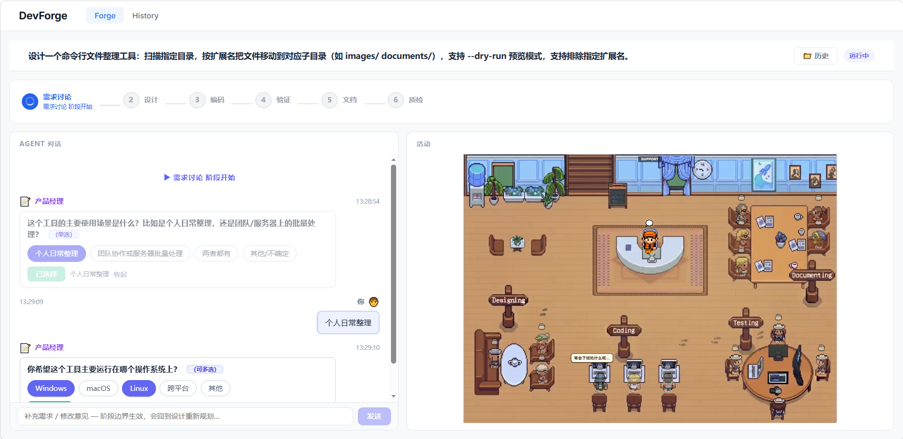
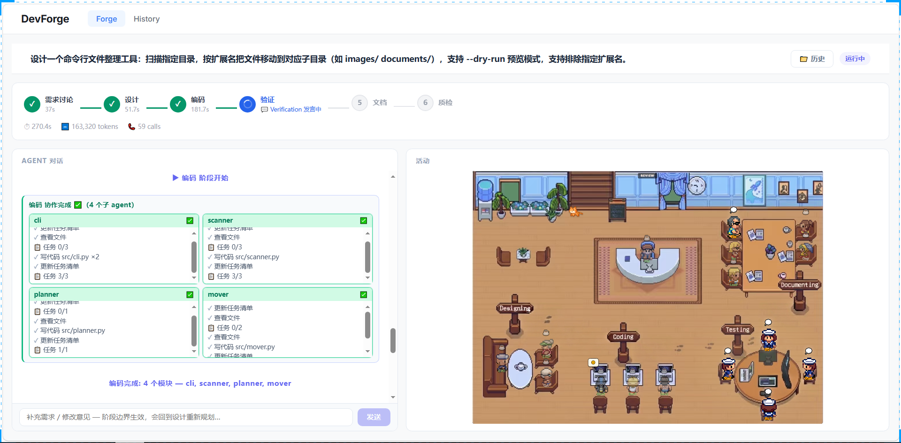

<div align="center">

# DevForge · 多智能体 AI 代码生成平台

**一句话需求 → 虚拟软件公司协作（PM/CTO/程序员/审查员/质检）→ 可运行的项目**

[](https://www.python.org/downloads/)
[]()
[]()
[](LICENSE)

</div>

---

## 📌 目录

- [核心功能](#-核心功能)
- [演示](#-演示)
- [它解决什么问题](#-它解决什么问题)
- [核心设计决策](#-核心设计决策)
- [系统架构](#-系统架构)
- [目录结构](#-目录结构)
- [快速开始](#-快速开始)
  - [环境要求](#-环境要求)
  - [安装](#-安装)
  - [配置](#-配置)
  - [运行](#-运行)
  - [提交任务](#-提交任务)
- [技术栈](#-技术栈)
- [实测数据](#-实测数据)
- [未来规划](#-未来规划)
- [免责声明与许可](#-免责声明与许可)

---

## 🛠 核心功能

- **🤖 多智能体流水线** — 6 个主阶段 + 动态增量迭代（需求澄清 → 设计 → 编码 → 验证 → 质检 → 文档），10+ 个角色分工协作，coder 并行写模块；流水线拓扑（阶段顺序、错误重试、质检回跳/升级目标）由 `pipeline_spec` 配置声明式驱动
- **👁 全程实时可视化** — WebSocket 事件流驱动 Vue 3 前端：像素办公室动画、agent 对话、审查卡片、质检结论，断线可回放；每阶段 token 消耗实时统计（`phase_usage` 事件）
- **🧠 跨项目记忆** — ChromaDB 沉淀"阶段方案"、"已验证的函数级代码"与"修复模式"（learn_fix_pattern：错误签名 → 修复对照，只收验证过的），后续项目自动召回复用
- **🔁 质量闭环** — tester 写测试 → reviewer×4 并行审查（**带真实测试证据**）→ fixer 修复 → 平台 AST 契约硬门禁 → 质检 FAIL 回跳重修，**同缺口二跳自动升级重设计**，不再只压给 fixer
- **🛡 执行安全** — 生成代码跑在 Docker 沙箱（代理免疫、依赖自动安装）；宿主机回退时静态扫描分级（项目根内文件操作放行）+ **运行期沙箱 shim**（逃逸项目根/系统临时目录即拦截）
- **💸 成本工程** — 工具批量读取、上下文压缩（头尾保留截断）、结果缓存、**阶段 token 预算统计**（超预算提前收尾，不无限修复）、全局熔断（默认 800k 预警 / 1.5M 硬停），失败不会无限烧钱
- **💾 断点与恢复** — 阶段 checkpoint + 事件增量落盘（服务中途被杀不丢运行记录）+ **agent 对话历史归档**（同阶段重跑自动恢复上下文，不再"失忆"）

---

## 📺 演示

> 真实运行截图（以"命令行文件整理工具"为例）。

**需求澄清** — PM 通过选择题逐项澄清需求，而不是一次生成：

<p align="center">
  
</p>

**编码完成** — 多个 coder 并行写模块、integrator 联调对账，交付完整项目：

<p align="center">
  
</p>

整个运行过程像一场"软件开发的直播"：像素小人走进办公室、agent 对话实时滚动、审查员提交 diff 卡片、质检给出结论，断线可回放。

---

## 🎯 它解决什么问题

**"帮我写一个 XX 工具"——直接丢给 ChatGPT 会得到什么？**
一段看起来很华丽的代码：没有测试、没有文档、import 到处报错、跑起来根本不是你要的。再追问几轮，它改一处坏两处。

DevForge 的目标：**一句话需求 → 一个跑得起来、测得过、看得到的项目**。

**1. 生成 ≠ 交付**
- 一次生成"整个项目"最大的坑，是没人问过你：给谁用？命令行还是桌面？要不要预览模式？等代码写完了才发现理解偏了，全部重来
- DevForge 把过程变成流水线：**PM 澄清需求 → CTO 设计架构 → coder 并行编码 → tester 写测试 → 4 个审查者挑毛病 → fixer 修复 → 质检打分**。每一步有专门角色和验证动作，最终质检不达标就回跳重修——不是一次赌运气

**2. 多 agent 并行，接口怎么不错位？**
- 多个 coder 同时写模块，谁都看不见别人的代码——`cli` 调 `organizer` 的函数没传参数，这种错位在普通流程里要等集成时才暴露
- DevForge 在 Design 阶段由 CTO 定义每个模块的**接口契约**（导出函数 + 签名），coder 只按契约写；integrator 对账；平台层再 AST 校验契约完整性（编码整合前注入 integrator 强制修复，质检时 AST 复查缺口直接 FAIL 进回跳/升级）——缺失的导出直接报告出来强制修复，不靠 agent 自觉

**3. 一次跑要烧多少 token？**
- 多 agent 流水线天然烧钱：每次工具调用都是一次 LLM 往返，历史越滚越大。
- DevForge 的成本工程：批量读取（一次调用读全部文件）、上下文压缩、工具结果缓存（重复执行/重复读取拦截）、按环节收紧轮次、**阶段级 token 预算统计**（超预算渐进降级），外加全局熔断兜底。

---

## 🏛 核心设计决策

**1. 为什么是多 agent：软件开发是流程，不是一次生成**
- 单个 LLM 调用能写出代码，但"澄清需求 → 设计架构 → 编码 → 测试 → 审查 → 修复 → 质检"是七种不同的认知任务——混在一个 agent 里会角色混淆（自己写代码自己审查）、上下文爆炸（全流程历史装不下）、无法验证（没有独立角色检查它）
- 选择：拆成 10+ 个角色，每个角色**单一职责 + 明确的验证动作**（tester 必须跑通测试、reviewer 必须输出结构化问题清单、inspector 必须打分判定）
- 代价：多 agent 协作引入协调成本（接口对齐、上下文传递）——接下来的决策都在处理这个代价

**2. agent 之间怎么交流：契约 + 黑板，不是自由对话**
- agent 自由对话（ChatGPT 式多轮）成本高、不可控、无法校验——两个 agent 聊十轮，谁也不知道对方到底交付了什么
- 选择：阶段间的交接全部**结构化**——需求对象、模块契约、审查 issues、质检报告都是 JSON，落在 Blackboard（共享工作台，单一事实源）；自由对话只保留在需要协商的场景（CTO/CPO 设计讨论，且以 "I AGREE" 收敛）
- 好处：每个交接点可 schema 校验（无效输出丢弃重出）、可落盘审计（checkpoint 断点重跑）、可前端回放

**3. 怎么约束 agent：最小权限 + 校验 + 上限 + 平台兜底**
- 不给约束，agent 会失控：coder 跑去跑代码看报错浪费时间、reviewer 反复读文件烧钱、修复声称完成却没改任何文件
- 四层约束，**能平台校验的绝不依赖 agent 自觉**：
  - **工具白名单**按角色配置，且是**硬约束**——`execute` 校验当前 agent 的允许工具集，越权调用直接拒绝；并行 coder 按模块文件白名单隔离，**只能写/改自己模块的文件**（平台拦截，不再靠自觉）
  - **结构化输出校验**——审查/设计/质检输出过 JSON schema，非法输出丢弃重出，宁缺毋滥
  - **轮次上限**——每个角色限定工具调用轮数，耗尽强制收尾，防死循环
  - **平台兜底**——契约缺口 AST 校验（编码整合前注入强制修复、质检时复查缺口直接 FAIL 进回跳/升级）、已读拦截（同 agent 同文件不重发内容）、工具结果缓存、幻觉修复警告（声称修了却没改文件 = 失败）

**4. 协作拓扑：阶段串行 + 角色并行 + 质量门禁回跳/升级**
- **阶段之间串行**（需求 → 设计 → 编码 → 验证 → 质检 → 文档）：顺序依赖，不能乱；拓扑由 `pipeline_spec` 声明式配置，重排/自定义流水线不改代码
- **阶段之内并行**（coder×N 并行写模块、reviewer×4 并行审查）：提速的关键，4 个 coder 同时写 4 个模块
- **质量门禁**：质检 FAIL 回跳 Verification 重修（≤3 次）；**同一批缺口第二次 QG 仍存在 → 自动升级回 Design 重新设计**（fixer 修不动 = 架构问题，且质检反馈喂给 CTO），不达标的项目带失败标记交付；测试框架类问题（evidence 项）不回跳——修不了环境问题就白烧三轮
- **用户随时可干预**：阶段边界消费用户消息——已编码的项目**动态插入 Iterate 阶段走增量迭代**，未编码的回退设计重来；修复 diff 送人工审阅，拒绝则带着反馈重修（迭代被拒也自动重做一次）

**5. 知识沉淀：记忆只存"验证过的"**
- 失败的经验（半途而废的需求、修不好的 bug）教给下一个项目 = 污染
- 选择：质检 **PASS / 高分 WARN 才写入记忆**，召回侧**仅返回验证通过条目**（函数记忆三态标记 verified / has-issues / unreviewed——**没查过不等于通过**）；修复轮后测试通过才学习**修复模式**（错误签名 → 修复前后对照），fixer 下次遇到同类错误直接参考
- 效果：记忆库是跨项目的"已验证知识库"——CTO 召回历史设计方案，coder 召回已验证的函数实现，fixer 召回已验证的修复模式

**支撑层**（非协作核心，但决定可用性）：
- **执行安全** — 生成代码跑在 Docker 沙箱（代理免疫、依赖自动安装），不可用时回退宿主机：静态 AST 扫描分级（命令执行/动态代码硬拦截；文件操作按路径分级，项目根内相对路径放行）+ 运行期沙箱 shim（sitecustomize 拦截逃逸项目根/系统临时目录的操作）
- **成本工程** — 批量读取、上下文压缩、结果缓存、按环节收紧轮次、阶段预算统计（超预算提前收尾）+ 全局熔断（默认 800k 预警 / 1.5M 硬停），失败不会无限烧钱

---

## 🧩 系统架构

一次任务从需求到交付，走完 6 个阶段：

```
用户一句话需求
    │
    ▼
① RequirementsDiscussion  PM 澄清需求（提问/headless 直出）
② Design                  CTO 模块契约 + CPO 审查（2-4 模块）
③ Coding                  coder×N 并行写模块 → integrator 对账 → tester 写测试
④ Verification            reviewer×4 审查（含测试证据）→ fixer 修复 → 复测（可循环 2 轮）
⑤ QualityGate             inspector 判定 PASS/WARN/FAIL（平台契约硬门禁）
      FAIL → 回跳 ④（≤3 次；同缺口二跳 → 回 ② 重新设计）
      PASS/WARN → ⑥ 生成文档
⑥ Documentation           dependency_analyst + technical_writer
    │
    ▼
交付：WareHouse/<任务>_DevForge_<时间戳>_<run_id>/
      ├── 代码（src/ 布局）   ├── 测试（test_*.py）
      ├── 文档 + requirements.txt   └── .devforge/（checkpoint / 事件 / agent 历史）
```

**分层** — 四层分工：

| 层 | 职责 |
|---|---|
| **前端**（Vue 3 + WebSocket） | 可视化与交互：像素办公室、agent 对话、审查卡片、质检结论、历史回放 |
| **后端**（FastAPI） | 任务队列（FIFO 单活）→ 流水线引擎（`pipeline_spec` 表驱动）→ Agent（ReAct + 工具循环）；Blackboard 共享状态，checkpoint + agent 历史落盘支持断点续跑 |
| **LLM 与执行** | DeepSeek API + Docker 沙箱（代理免疫、依赖自动安装），不可用回退宿主机 + 静态扫描分级 + 运行期沙箱 shim |
| **记忆**（ChromaDB） | 阶段方案、已验证函数、修复模式跨项目召回，只收"验证过"的经验 |

**贯穿层** — 支撑多 agent 协作的四个机制：

| 机制 | 职责 |
|---|---|
| **事件总线** | 每个 agent 动作都发事件 → WebSocket 实时推前端；per-run seq 保序、关键事件裁剪保护、流式输出合并降噪、阶段 token 统计 |
| **工具注册表** | 10 个工具按角色白名单**硬约束**注入（coder 只读写、reviewer 只读、fixer 读写+测试）；结果缓存 + 已读拦截（per-agent），杜绝重复执行和重复读取 |
| **Blackboard** | 所有 agent 共享的工作台：需求/模块契约/代码/审查结果/checkpoint，阶段边界落盘 |
| **记忆** | 跨项目沉淀"验证过"的知识（阶段方案 / 函数实现 / 修复模式），后续项目自动召回复用 |

---

## 📁 目录结构

```
src/
├── core/        # 基础设施：配置 / 日志 / 事件总线 / 文本解析
├── codegen/     # 生成核心（DDD 分层）
│   ├── domain/          # Agent / Phase / Blackboard / 契约 / 端口
│   ├── application/     # 流水线引擎（spec 表驱动）+ 各阶段实现
│   │   ├── spec.py      # 编排 DSL：阶段描述符（重试/预算/质检跳转）
│   │   └── phases/      # 需求/设计/编码/验证/质检/文档/迭代
│   └── infrastructure/  # LLM 客户端 / 工具系统（文件/代码/计划/搜索）/ 沙箱 shim
├── memory/      # ChromaDB 记忆（domain / infrastructure / 提示格式化）
└── serving/     # FastAPI + WebSocket 服务（接口 / 任务队列 / 运行状态机）
web/             # Vue 3 + TS 前端（Dashboard / 像素办公室 / 历史 / 项目详情）
configs/         # 流水线配置（pipeline_spec）/ 角色定义 / prompt 模板 / JSON schema
scripts/         # 服务启动入口
```

---

## 🚀 快速开始

### 环境要求
- Python 3.10+（推荐 uv 管理）
- Node.js 18+
- Docker（可选，沙箱执行；不可用自动回退宿主机）
- LLM API key（DeepSeek / OpenAI 兼容）

### 安装

```bash
# 后端
uv venv && uv pip install -e ".[dev]"

# 前端
cd web && npm install && cd ..
```

### 配置

```bash
cp configs/default.example.json configs/default.json
# 编辑 configs/default.json，填入你的 llm.api_key
```

### 运行

**方式一：一键启动**
```
双击 start.cmd
```

**方式二：手动**
```bash
# 后端（API: http://localhost:8000）
python scripts/run_server.py

# 前端（页面: http://localhost:5173）
cd web && npm run dev
```

### 提交任务

打开前端页面，输入任务描述，例如：
> 设计一个命令行文件整理工具：扫描指定目录，按扩展名把文件移动到对应子目录（如 images/ documents/），支持 --dry-run 预览模式，支持排除指定扩展名。

也可以直接调 API：`POST /api/run`（form 参数 `task`）。

---

## 🧰 技术栈

| 层次 | 技术 |
|------|------|
| 后端 | Python 3.10+ · FastAPI · uvicorn · WebSocket |
| 前端 | Vue 3 · TypeScript · Vite |
| LLM | openai SDK（DeepSeek / OpenAI 兼容） |
| 记忆 | ChromaDB（阶段方案 / 函数实现 / 修复模式三集合） |
| 执行 | Docker 沙箱（python:3.12-slim）· 静态扫描分级 + 运行期沙箱 shim（宿主回退） |
| 架构 | DDD 分层（domain / application / infrastructure / interfaces）· 编排 spec 表驱动 |
| 质量 | pytest · pytest-cov · ruff · vitest |
| 依赖 | uv + pyproject.toml + uv.lock |

---

## 📊 实测数据

> 2026-08 全量评测，DeepSeek 真实 API 运行；评测任务集与验证脚本见 `benchmarks/`（本地）。

| 指标 | 数值 |
|---|---|
| 端到端任务集 | 10 个（CLI 工具 / 数据分析 / 文件系统 / REST 服务 / ETL 管道） |
| 首次编译通过率 | 90% |
| 生成代码可运行交付率（修复前 → 后） | 20% → 90% |
| 质检通过率（修复前 → 后） | 40% → 80% |
| LLM 前缀缓存命中率 | 72–80% |
| 单任务交付时长 | 10–19 分钟 |
| 平台自身测试 | 298 个 pytest 用例全绿 |

---

## 🗺 未来规划

**近期 — 把流水线跑得更稳**
- [x] **修复能力增强** — `edit_file` 行级补丁（不再整文件重写）+ 质检**同缺口自动升级重设计**（不再死磕同一个 fixer）
- [x] **测试链路加固** — 平台 AST 契约硬门禁：质检复查契约缺口直接 FAIL，进回跳/升级通道
- [ ] **前端体验** — 阶段时间线、token 实时仪表盘（`phase_usage` 事件已就绪）、生成项目在线预览

**中期 — 扩展边界**
- [ ] **更多语言支持** — 从 Python-only 扩展到 TypeScript/Go（契约系统已语言中立，主要是执行与测试链路的适配）
- [ ] **记忆质量提升** — 中文语义检索（当前英文嵌入模型 + 关键词兜底，需引入多语言嵌入）、召回排序优化、记忆条目自动合并去重、跨任务知识蒸馏
- [ ] **评测扩展** — 任务集扩充到 20+、引入人工评分维度、支持并行评测

**远期 — 成为可依赖的 AI 软件开发基础设施**
- [ ] 让"一句话 → 可运行软件"的完整过程**可审计、可复现、成本透明**：每个决策有据可查、每次交付可回放、每分钱花在明处

---

## ⚖️ 免责声明与许可

**使用边界**：
- 本项目生成的代码由 LLM 产生，**使用前必须人工审查与测试**——尤其涉及文件操作、网络、安全敏感逻辑时
- 像素办公室素材为本地持有资源（版权未知），未随仓库分发；本地运行需保留 `web/public/sprites/`
- `configs/default.json` 含你的 API key，**不要提交到任何公开仓库**（仓库内仅有占位模板）

**许可**：[Apache License 2.0](LICENSE)

---

**DevForge — 让 AI 软件开发从"单次生成"变成"可验证的工程流水线"。**
